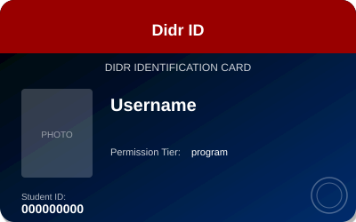

# Didr-ID Cred

A brief description of what this credential represents and its purpose.

## Claims

- `username` "Claim Label" (string): Username of the human [mandatory]
  - sv: "användarnamn" - Användarnamn motsvarande individen
- `permission_tier` "Permission Tier" (type): Permission tier, if provided
- `userid` "User ID" (string): ID [sd=always]

### Claim Types

Available types for claims:
- `string` - Text values (default)
- `integer` - Whole numbers
- `date` - Date values (YYYY-MM-DD)
- `datetime` - Date with time (ISO 8601)
- `boolean` - True/false values
- `image` - Base64-encoded image data

## Images

